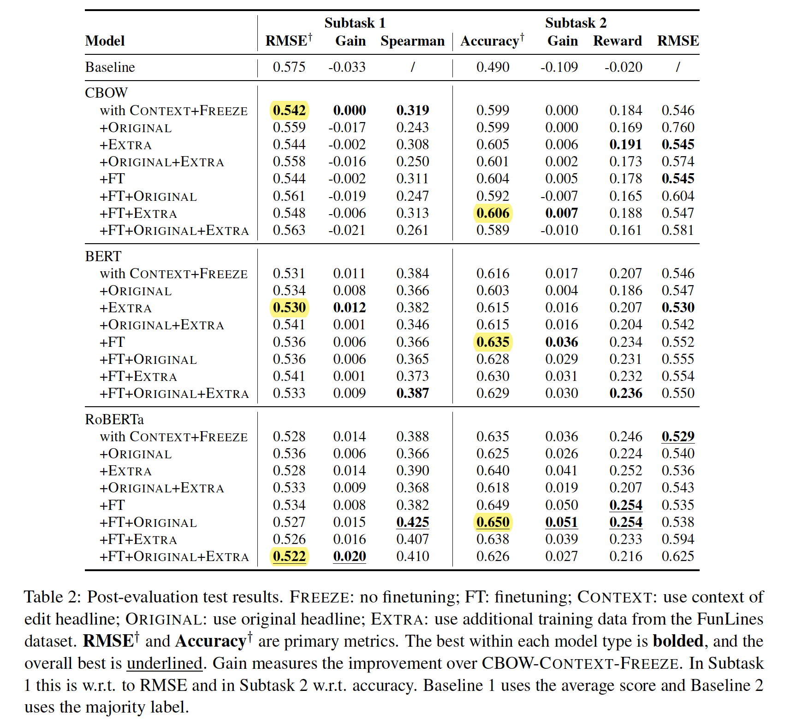
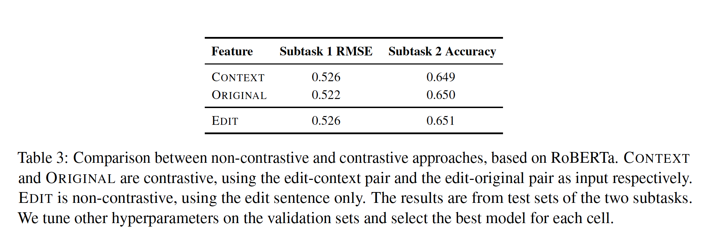

# Duluth at SemEval-2020 Task 7


This is the codebase for our SemEval 2020 paper: [Duluth at SemEval-2020 Task 7: Using Surprise as a Key to Unlock Humorous Headlines](https://arxiv.org/abs/2009.02795).

```
@inproceedings{duluth2020humor,
    title = "Duluth at SemEval-2020 Task 7: Using Surprise as a Key to Unlock Humorous Headlines",
    author = "Shuning Jin and Yue Yin and XianE Tang and Ted Pedersen",
    booktitle = "Proceedings of the 14th International Workshop on Semantic Evaluation (SemEval 2020)",
    year = "2020",
    url = "https://arxiv.org/abs/2009.02795"
}
```


## Task Introduction

SemEval-2020 Task 7: Assessing Humor in Edited News Headlines
- [Competition page](https://competitions.codalab.org/competitions/20970)
  - Subtask 1: regression task to predict the funniness score of an edited headline
  - Subtask 2: classification task to predict the funnier between two edited headlines
- Leaderboard for offical evaluation
  - [webpage version](https://competitions.codalab.org/competitions/20970#results): “Evaluation-Task-1” is for Subtask 1 and “Evaluation-Task-2” is for Subtask 2.
  - [cleaned csv version](code/official_evaluation_result.csv)
  - **Our system** ranks 11/49 (0.531 RMSE) in Subtask 1, and 9/32 (0.632 accuracy) in Subtask 2.


## 1 Configuration

**conda environment**

- packages are specified in [environment.yml](environment.yml)

- require conda3: [Anaconda 3](https://docs.anaconda.com/anaconda/install/) or [Miniconda 3](https://docs.conda.io/en/latest/miniconda.html)

  - create [conda environment](https://docs.conda.io/projects/conda/en/latest/user-guide/tasks/manage-environments.html):
    ```bash
    conda env create -f environment.yml
    ```

  - activate/deactivate the environment:
    ```bash
    # linux/mac (conda>=3.6):
    conda activate humor
    conda deactivate
    # linux/mac (conda<3.6):
    source activate humor
    source deactivate
    # windows:
    activate humor
    deactivate
    ```

**spaCy**

```bash
python -m spacy download en
```

**HuggingFace Transformers Cache Directory**

we use the [transformers library by HuggingFace](https://github.com/huggingface/transformers). Save caches so you don't have to download the same model more than once.

```bash
# replace `/path/to/cache/directory` with your directory
CACHE=/path/to/cache/directory
bash scripts/path_setup.sh HUGGINGFACE_TRANSFORMERS_CACHE $CACHE
# this will add the following line to ~/.bash_profile (mac) or ~/.bashrc (linux)
# export HUGGINGFACE_TRANSFORMERS_CACHE=/path/to/cache/directory
```

## 2 Data

-   see [data](data) directory
-   datasets: [Humicroedit](https://www.aclweb.org/anthology/N19-1012/) (official task data) and [Funlines](https://arxiv.org/pdf/2002.02031.pdf) (additional training data)
-   you can download the data from the [source website](https://www.cs.rochester.edu/u/nhossain/humicroedit.html), or simply run
    ```bash
    bash scripts/download_data.sh
    ```
    This gives the same data as in `data` directory.

## 3 Experiment output

    experiment_directory
    ├── log.log
    ├── params.json
    # if args.save_model
    ├── model_state.th
    # if args.tensorboard
    ├── tensorboard_train
    ├── tensorboard_val
    # if args.do_eval
    └── output-{eval_data_name}.csv

To see [tensorboard](https://pytorch.org/docs/stable/tensorboard.html) output:

```bash
open http://localhost:6006
tensorboard --logdir tensorboard_train
# you may need to wait a few seconds and refresh the page

open http://localhost:6006
tensorboard --logdir tensorboard_val
# you may need to wait a few seconds and refresh the page
```

## 4 Scripts
<!-- : [see here](scripts/table2) -->

- Baseline
  - Baseline 1 uses the average score; Baseline 2 uses the majority label.
  - output will be in `baseline_output` directory

    ```bash
    bash scripts/baseline.sh > baseline_output/results.log
    ```
- To reproduce our **main experiment** based on the contrastive approach (Table 2 in the paper):

  - produce the highlighted numbers (i.e., best within each model type), with this [script](scripts/table2_best.sh)

    ```bash
    bash scripts/table2_best.sh
    ```

  - produce the whole table, with this [script](scripts/table2.sh)

    ```bash
    bash scripts/table2.sh
    ```

  - Table 2
  


<!-- : [see here](scripts/table3) -->
- To reproduce the additional analysis on the non-contrastive approach (Table 3 in the paper)

  - use this [script](scripts/table3.sh)

    ```bash
    bash scripts/table3.sh
    ```

  - Table 3
  
